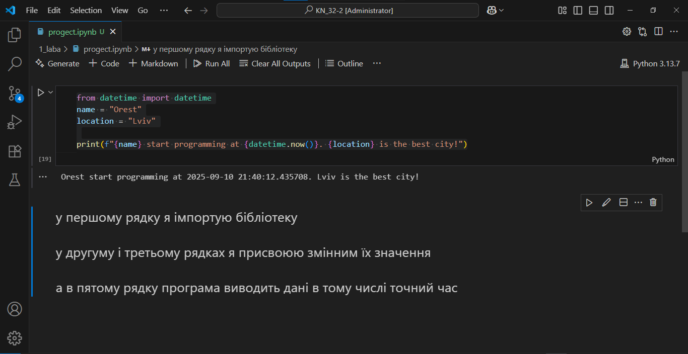

# Звіт до роботи
## Тема: _робота з Python_ 
### Мета роботи: Навчитись кодити на Python з використанням опису на Markdown

---
### Виконання роботи
* Результати виконання завдання *1 лабораторної роботи*
    1. Зробив студент 3 курсу Михайлів Орест Михайлович
    2. Програма вивела значення:
    ```
    PS D:\KN_32-2> & C:/Users/SystemX/AppData/Local/Programs/Python/Python313/python.exe d:/KN_32-2/1_laba/first_progect.py     
    Orest start programming at 2025-09-11 18:32:45.611241. Lviv is the best city!
    ```
    3. Отримані дані точного часу 
    4. Здобув практичні навички роботи з *GitHub*, *Markdown* та *Visual Code*
   
[файл з першою лабораторною](/1_laba/progect.ipynb)


    

   
 - Ось цей код з можливістю копіювати

    ```python
    from datetime import datetime
    name = "Orest"
    location = "Lviv"

    print(f"{name} start programming at {datetime.now()}. {location} is the best city!")
    ```
- також ось __PYTHON__ код який за допомогою бібліотеки Turtle малює  


    
[тут](/1_laba/first_progect.py) представлено код цієї команди


## Висновок:
> у висновку потрібно відповісти на запитання:

- Дана робота була зроблена для демокстрації набутих навичок;
- Мета роботи було воконана так як освоїв програми для роботи в сфері IT;
- Отримані навички в розробленні свого рипозиторія і т.д.;
- вдалось виконати усі поставлені завдання перед собою;
- Звісно виникили проблеми але вони досить легко були виправлені;
- Точно сказати не можу але впринципі може бути;
- Немаю;
