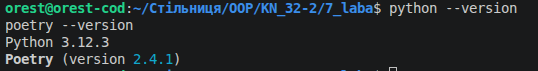
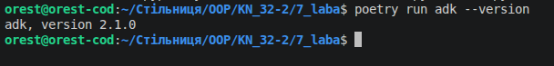
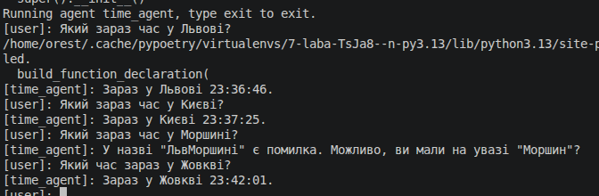
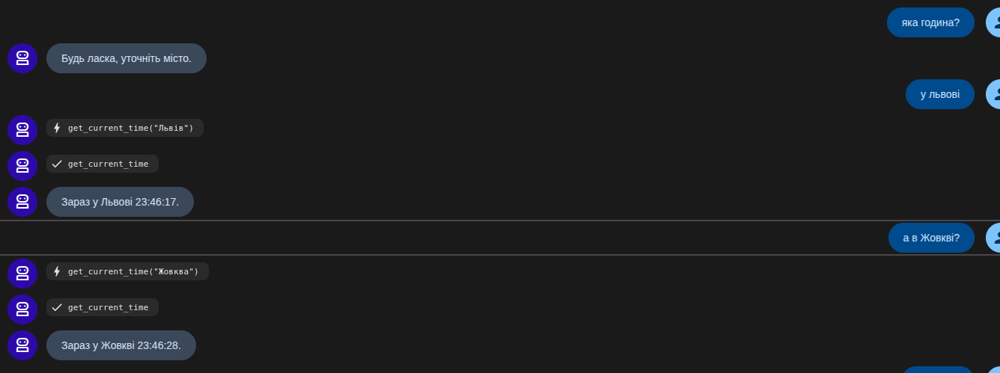
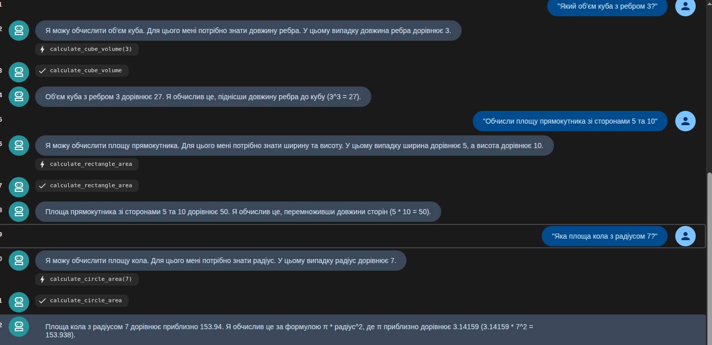
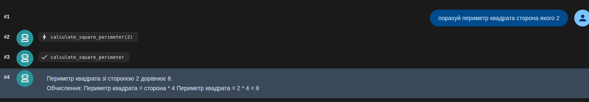

2

### Файл poetry.lock потрібен для фіксації точних версій усіх залежностей проєкту. Він гарантує, що застосунок розгортатиметься абсолютно однаково на комп'ютері будь-якого розробника, на тестовому сервері та в продакшені.

adk create — створює новий проєкт. Автоматично генерує структуру папок, шаблони коду та стартові конфігураційні файли для майбутнього ШІ-агента.
adk run — запускає агента в терміналі. Дозволяє швидко протестувати ШІ у текстовому режимі (чат прямо в консолі), щоб миттєво перевірити логіку його відповідей.
adk web — відкриває графічний чат у браузері. Запускає зручний веб-інтерфейс (Web UI) із розширеними інструментами розробника: логами, візуалізацією мислення моделі та можливістю виправляти помилки агента «на льоту».


# Створення простого агента з інструментом

1. **Що таке клас Agent** Клас Agent — це головний оркестратор (мозок) програми. Він об'єднує велику мовну модель (LLM), системні інструкції (промпт) та доступні інструменти в єдину сутність.У коді через конструктор Agent(...) задаються ключові параметри ШІ:model: Визначає «двигун» мислення (швидку та ефективну модель gemini-2.5-flash).name та description: Ідентифікують агента всередині системи ADK.instruction: Системний промпт, який задає роль, обмеження (відповідати українською) та формат виводу (HH:MM:SS).
2. **Для чого потрібен параметр tools** Параметр tools реалізує концепцію Function Calling (виклику функцій). Сама по собі мовна модель не знає поточного часу, оскільки її знання обмежені датою зрізу навчання.Передаючи список tools=`[get_current_time]`, ми:Розширюємо можливості ШІ, даючи йому змогу взаємодіяти із зовнішнім світом (базами даних, API, системним часом).Дозволяємо моделі самостійно вирішувати, коли саме потрібно викликати цю функцію на основі запиту користувача (наприклад, якщо запитати «Котра година в Києві?»).
3. **Що робить функція get_current_time** Це конкретний інструмент (навичка), яким володіє агент. Функція виконує роль "містка" між ШІ та операційною системою:Документування (docstring): Опис функції та її аргументів (Args/Returns) є критично важливим. Модель читає цей текст, щоб зрозуміти, що робить функція та які параметри (city) туди передавати.Логіка: Функція отримує назву м іста, бере поточний системний час комп'ютера за допомогою стандартної бібл іотеки Python datetime і повертає структурований словник (JSON-под ібний об'єкт) із результатом.



# Запуск агента через веб-інтерфейс



## відповіді агента math_agent на питання:

```
"Обчисли площу прямокутника зі сторонами 5 та 10"   
"Яка площа кола з радіусом 7?"  
"Який об'єм куба з ребром 3?"   
```






## відповіді агента student_helper на питання:
```
"Поясни що таке декоратори в Python"    
"Як працює list comprehension?"    
"Перевір синтаксис: print('Hello World')"   
```

```Python
 Чудово! Я бачу, що ти цікавишся цією темою. Декоратори в Python - це дуже потужна і елегантна фіча, яка дозволяє змінювати або розширювати функціональність інших функцій (або класів) без зміни їхнього вихідного коду. Це схоже на обгортку: ви берете вже існуючу функцію, обгортаєте її в декоратор, і тепер ця функція має додаткову поведінку.

### Основна ідея

Декоратор - це по суті функція, яка приймає іншу функцію як аргумент, додає до неї якусь функціональність і повертає нову функцію (або змінену версію оригінальної).

### Як це виглядає?

Синтаксис використання декораторів досить простий. Ви ставите символ `@` перед назвою функції, яку хочете декорувати, а потім пишете назву декоратора.

Ось приклад:

def my_decorator(func):
    def wrapper(*args, **kwargs):
        print("Щось відбувається перед викликом функції.")
        result = func(*args, **kwargs)
        print("Щось відбувається після виклику функції.")
        return result
    return wrapper

@my_decorator
def say_hello(name):
    print(f"Привіт, {name}!")
    return f"Привіт, {name}!"

# Викликаємо декоровану функцію
say_hello("Олег")

**Пояснення до прикладу:**

1.  **`my_decorator(func)`**: Це наш декоратор. Він приймає функцію `func` як аргумент.
2.  **`wrapper(*args, **kwargs)`**: Всередині `my_decorator` ми визначаємо вкладену функцію `wrapper`. Ця функція буде виконувати додаткову логіку.
    *   `print("Щось відбувається перед викликом функції.")`: Тут ми додаємо поведінку, яка виконується *перед* викликом оригінальної функції.
    *   `result = func(*args, **kwargs)`: Це власне виклик оригінальної функції `say_hello`. `*args` та `**kwargs` дозволяють `wrapper` приймати будь-які аргументи, які були передані `say_hello`.
    *   `print("Щось відбувається після виклику функції.")`: Тут ми додаємо поведінку, яка виконується *після* виклику оригінальної функції.
    *   `return result`: `wrapper` повертає результат виконання оригінальної функції.
3.  **`return wrapper`**: Декоратор повертає вкладену функцію `wrapper`. Коли ви використовуєте `@my_decorator` перед `say_hello`, Python фактично робить наступне:
    `say_hello = my_decorator(say_hello)`.
4.  **`@my_decorator`**: Це синтаксичний цукор. Він перетворює функцію `say_hello` на результат виклику `my_decorator(say_hello)`.

### Навіщо вони потрібні?

Декоратори дуже корисні для вирішення багатьох завдань, таких як:

*   **Логування**: Записувати інформацію про виклик функції (коли викликана, з якими аргументами, який результат).
*   **Вимірювання часу виконання**: Виміряти, скільки часу займає виконання функції.
*   **Перевірка дозволів/авторизація**: Перевіряти, чи має користувач право викликати певну функцію.
*   **Кешування**: Зберігати результати виконання функції, щоб не обчислювати їх знову.
*   **Валідація**: Перевіряти вхідні дані функції.

### Приклад: Вимірювання часу виконання

import time

def timer(func):
    def wrapper(*args, **kwargs):
        start_time = time.time()
        result = func(*args, **kwargs)
        end_time = time.time()
        print(f"Функція {func.__name__} виконувалася {end_time - start_time:.4f} секунд.")
        return result
    return wrapper

@timer
def long_running_function(n):
    total = 0
    for i in range(n):
        total += i
    return total

@timer
def short_function():
    time.sleep(0.1)
    print("Коротка функція завершена.")

long_running_function(10000000)
short_function()


Тут `timer` - це декоратор, який вимірює час виконання будь-якої функції, до якої він застосовується.

Якщо щось незрозуміло, або хочеш ще прикладів, дай знати!
```

```Python
Як працює list comprehension?
/home/orest/.cache/pypoetry/virtualenvs/7-laba-TsJa8--n-py3.13/lib/python3.13/site-packages/google/adk/tools/function_tool.py:95: UserWarning: [EXPERIMENTAL] feature FeatureName.JSON_SCHEMA_FOR_FUNC_DECL is enabled.
  build_function_declaration(
[student_helper]: List comprehension (або "розуміння списків") в Python - це елегантний і стислий спосіб створення списків. Він дозволяє створювати новий список, застосовуючи вираз до кожного елементу в існуючій послідовності (наприклад, списку, кортежу, рядка) і, за бажанням, фільтруючи елементи.

**Основний синтаксис:**

```python
новий_список = [вираз for елемент in існуюча_послідовність if умова]
```

**Розберемо по частинах:**

1.  **`вираз`**: Це те, що буде обчислюватися для кожного елемента і додаватися до нового списку. Це може бути сам `елемент`, або якась операція з ним (наприклад, `елемент * 2`, `елемент.upper()`).
2.  **`for елемент in існуюча_послідовність`**: Це основна частина, яка ітерується по елементах `існуючої_послідовності`. На кожній ітерації поточний елемент присвоюється змінній `елемент`.
3.  **`if умова` (необов'язково)**: Це фільтр. Якщо умова істинна для поточного `елемента`, він обробляється `виразом` і додається до нового списку. Якщо умова хибна, елемент пропускається.

**Простий приклад (без умови):**

Припустимо, нам потрібно створити список квадратів чисел від 0 до 9.

*   **Звичайний спосіб (цикл `for`):**

    ```python
    squares = []
    for i in range(10):
        squares.append(i * i)
    print(squares)
    # Виведе: [0, 1, 4, 9, 16, 25, 36, 49, 64, 81]
    ```

*   **З використанням list comprehension:**

    ```python
    squares = [i * i for i in range(10)]
    print(squares)
    # Виведе: [0, 1, 4, 9, 16, 25, 36, 49, 64, 81]
    ```

Як бачите, list comprehension значно коротший і часто легший для читання, коли ви розумієте його структуру.

**Приклад з умовою:**

Створимо список парних чисел від 0 до 9, піднесені до квадрату.

*   **Звичайний спосіб (цикл `for`):**

    ```python
    even_squares = []
    for i in range(10):
        if i % 2 == 0:
            even_squares.append(i * i)
    print(even_squares)
    # Виведе: [0, 4, 16, 36, 64]
    ```

*   **З використанням list comprehension:**

    ```python
    even_squares = [i * i for i in range(10) if i % 2 == 0]
    print(even_squares)
    # Виведе: [0, 4, 16, 36, 64]
    ```

**Переваги:**

*   **Стислість:** Код стає коротшим.
*   **Читабельність:** Після засвоєння синтаксису, такий код часто легше читати, ніж громіздкі цикли `for`.
*   **Продуктивність:** У багатьох випадках list comprehensions можуть бути трохи швидшими за еквівалентні цикли `for`, оскільки вони оптимізовані на рівні інтерпретатора Python.

**Best practice:**

*   Використовуйте list comprehension для простих і зрозумілих операцій.
*   Якщо логіка стає занадто складною (багато вкладених циклів, складні умови), краще повернутися до звичайного циклу `for` для кращої читабельності.

Хочете спробувати переписати якийсь цикл `for` у list comprehension, або перевірити синтаксис свого коду?
```


print('Hello World')

Цей код синтаксично правильний. Функція `print()` використовується для виведення рядка `'Hello World'` на консоль.

Хочете перевірити ще щось?
```

# Робота з конфігурацією агента

відповіді на питанння

"Напиши коротку історію про подорож у космосі"
"Створи казку про дружбу між роботом та людиною"


```
build_function_declaration(
[creative_writer]: Як щодо такого початку: "Зірка на ім'я Софія, самотня мандрівниця, дрейфувала у безкрайніх просторах космосу на своєму кораблі "Мандрівник". Її єдиними супутниками були бортовий комп'ютер Ел та голограма її покійного чоловіка, Олександра. Але одного дня, під час дослідження незвіданої туманності, "Мандрівник" потрапив у гравітаційну пастку, яка загрожувала розчавити корабель..."?

Чи бажаєш, щоб я продовжив цю історію, чи, можливо, ти маєш на увазі зовсім інший сюжет?
```