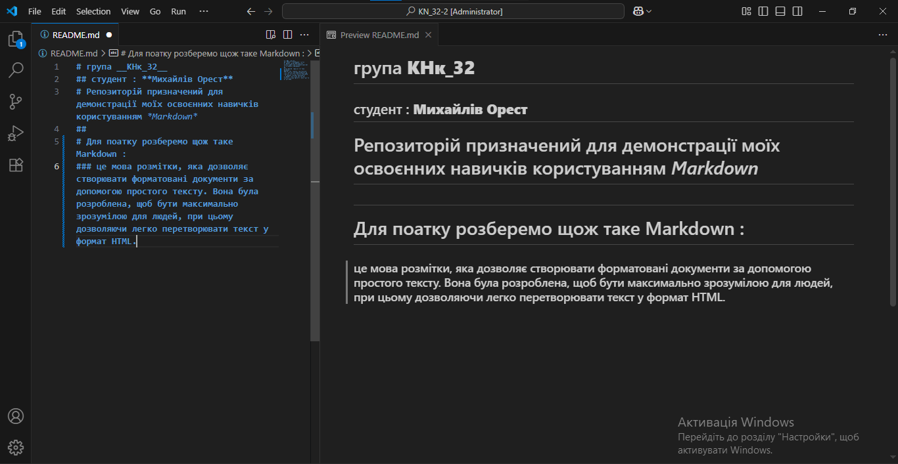

Markdown — це мова розмітки, яка дозволяє створювати форматовані документи за допомогою простого тексту. Вона була розроблена, щоб бути максимально зрозумілою для людей, при цьому дозволяючи легко перетворювати текст у формат HTML.

Markdown часто використовують для написання документації, README файлів, блогів і коментарів на різних платформах, включаючи GitHub, Reddit, Stack Overflow тощо. Оскільки Markdown є текстовою мовою, ви можете писати її в будь-якому простому редакторі тексту (наприклад, Visual Studio Code, Sublime Text тощо).

Основні елементи Markdown

Заголовки:
Використовують символи # для створення заголовків. Кількість # визначає рівень заголовка (від 1 до 6):

# Заголовок рівня 1
## Заголовок рівня 2
### Заголовок рівня 3
#### Заголовок рівня 4
##### Заголовок рівня 5
###### Заголовок рівня 6


Жирний текст:
Для виділення жирним використовують два зірочки або два підкреслення:

**жирний текст** або __жирний текст__


Курсив:
Для виділення курсивом використовують одну зірочку або одне підкреслення:

*курсив* або _курсив_


Списки:

Ненумеровані списки (мітки):

- елемент 1
- елемент 2
- елемент 3


Нумеровані списки (номери):

1. перший елемент
2. другий елемент
3. третій елемент


Посилання:
Для створення посилання використовують квадратні дужки для тексту і круглі для URL:


Зображення:
Синтаксис для зображень схожий на посилання, але перед квадратними дужками ставиться знак оклику:  


Цитати:
Цитати починаються зі знака >, і можуть бути вкладені:

> Це цитата
> > Це вкладена цитата


Код:

Для вбудованого коду (один рядок) використовують один знак зворотної косої риски (`):

`код`


Для багаторядкового коду використовують три знаки зворотної косої риски (```):

багаторядковий код

Горизонтальна лінія:
Для створення горизонтальної лінії достатньо трьох дефісів, зірочок або підкреслень на окремому рядку:

---

Приклад документа на Markdown
# Документ на Markdown

Це приклад **Markdown**. Ось основні елементи:

## Списки

- Перший елемент
- Другий елемент
- Третій елемент

1. Перший елемент нумерованого списку
2. Другий елемент

## Посилання

Перейдіть на [GitHub](https://github.com).

## Зображення

Ось зображення:




## Цитата

> Це цитата.

Переваги Markdown:

Простота: Для створення документів не потрібно вивчати складні мови розмітки, такі як HTML.

Гнучкість: Ви можете легко конвертувати Markdown у HTML або інші формати.

Легкість у читанні та написанні: Markdown зберігає документацію читабельною, навіть якщо ви відкриваєте її в текстовому редакторі.

Популярність: Багато платформ (GitHub, Reddit, Stack Overflow тощо) підтримують Markdown для створення і редагування контенту.

Як використовувати Markdown на GitHub?

На GitHub Markdown використовують в таких файлах, як README.md. Це дозволяє вам красиво оформляти документацію та інструкції для вашого проєкту.

Створіть файл з розширенням .md (наприклад, README.md).

Використовуйте синтаксис Markdown для форматування тексту.

Після цього ваші зміни можна побачити у вигляді красивої форматованої документації на GitHub.

Підсумок:

Markdown — це проста мова розмітки, яка дозволяє легко створювати форматовані документи без необхідності знати HTML. Це особливо корисно для створення документації, записів у блогах, README файлів тощо.