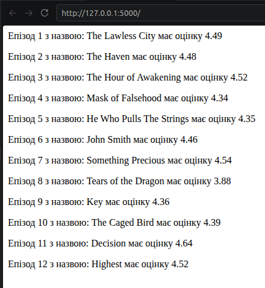
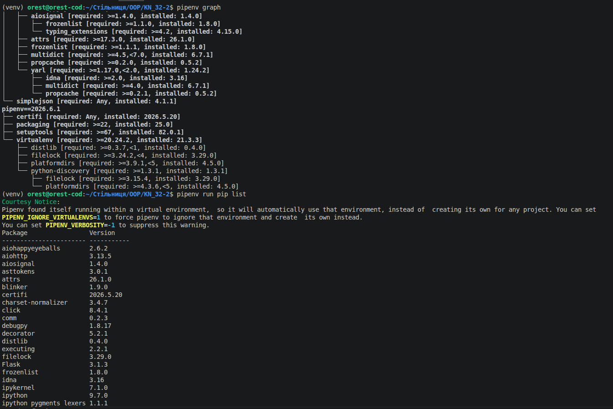
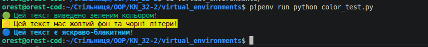

# Віртуальні середовища
## Основи роботи з сторонніми бібліотеками 
##  Крок 1. Перевірка та робота з інструментом PIP
### 1 Перевірка версії PIP та виклик довідки    
```python
    pip -V  
    pip --help
```
#### Приклад виведення команди: pip -V
    pip 24.0 from /usr/lib/python3/dist-packages/pip (python 3.12)
### 2 Перегляд встановлених бібліотек
```python
    pip list
```
#### Приклад виведення команди: pip -V
    attrs (23.2.0)
    Babel (2.10.3)  
    bcc (0.29.1)
<details>
  <summary><b>Показати список встановлених пакетів (81)</b></summary>
  <ul>
    <li><b>bcrypt</b> (3.2.2)</li>
    <li><b>blinker</b> (1.7.0)</li>
    <li><b>Brlapi</b> (0.8.5)</li>
    <li><b>certifi</b> (2023.11.17)</li>
    <li><b>chardet</b> (5.2.0)</li>
    <li><b>click</b> (8.1.6)</li>
    <li><b>cloud-init</b> (25.3)</li>
    <li><b>colorama</b> (0.4.6)</li>
    <li><b>command-not-found</b> (0.3)</li>
    <li><b>configobj</b> (5.0.8)</li>
    <li><b>cryptography</b> (41.0.7)</li>
    <li><b>cupshelpers</b> (1.0)</li>
    <li><b>dbus-python</b> (1.3.2)</li>
    <li><b>defer</b> (1.0.6)</li>
    <li><b>distro</b> (1.9.0)</li>
    <li><b>distro-info</b> (1.7+build1)</li>
    <li><b>duplicity</b> (2.1.4)</li>
    <li><b>fasteners</b> (0.18)</li>
    <li><b>httplib2</b> (0.20.4)</li>
    <li><b>idna</b> (3.6)</li>
    <li><b>Jinja2</b> (3.1.2)</li>
    <li><b>jsonpatch</b> (1.32)</li>
    <li><b>jsonpointer</b> (2.0)</li>
    <li><b>jsonschema</b> (4.10.3)</li>
    <li><b>language-selector</b> (0.1)</li>
    <li><b>launchpadlib</b> (1.11.0)</li>
    <li><b>lazr.restfulclient</b> (0.14.6)</li>
    <li><b>lazr.uri</b> (1.0.6)</li>
    <li><b>louis</b> (3.29.0)</li>
    <li><b>Mako</b> (1.3.2.dev0)</li>
    <li><b>markdown-it-py</b> (3.0.0)</li>
    <li><b>MarkupSafe</b> (2.1.5)</li>
    <li><b>mdurl</b> (0.1.2)</li>
    <li><b>monotonic</b> (1.6)</li>
    <li><b>netaddr</b> (0.8.0)</li>
    <li><b>netifaces</b> (0.11.0)</li>
    <li><b>oauthlib</b> (3.2.2)</li>
    <li><b>olefile</b> (0.46)</li>
    <li><b>paramiko</b> (2.12.0)</li>
    <li><b>pexpect</b> (4.9.0)</li>
    <li><b>pillow</b> (10.2.0)</li>
    <li><b>pip</b> (24.0)</li>
    <li><b>ptyprocess</b> (0.7.0)</li>
    <li><b>pycairo</b> (1.25.1)</li>
    <li><b>pycups</b> (2.0.1)</li>
    <li><b>Pygments</b> (2.17.2)</li>
    <li><b>PyGObject</b> (3.48.2)</li>
    <li><b>PyJWT</b> (2.7.0)</li>
    <li><b>PyNaCl</b> (1.5.0)</li>
    <li><b>pyparsing</b> (3.1.1)</li>
    <li><b>pyrsistent</b> (0.20.0)</li>
    <li><b>pyserial</b> (3.5)</li>
    <li><b>python-apt</b> (2.7.7+ubuntu5.2)</li>
    <li><b>python-dateutil</b> (2.8.2)</li>
    <li><b>python-debian</b> (0.1.49+ubuntu2)</li>
    <li><b>pytz</b> (2024.1)</li>
    <li><b>pyxdg</b> (0.28)</li>
    <li><b>PyYAML</b> (6.0.1)</li>
    <li><b>requests</b> (2.31.0)</li>
    <li><b>rich</b> (13.7.1)</li>
    <li><b>screen-resolution-extra</b> (0.0.0)</li>
    <li><b>setuptools</b> (68.1.2)</li>
    <li><b>six</b> (1.16.0)</li>
    <li><b>systemd-python</b> (235)</li>
    <li><b>typing_extensions</b> (4.10.0)</li>
    <li><b>ubuntu-drivers-common</b> (0.0.0)</li>
    <li><b>ubuntu-pro-client</b> (8001)</li>
    <li><b>ufw</b> (0.36.2)</li>
    <li><b>unattended-upgrades</b> (0.1)</li>
    <li><b>urllib3</b> (2.0.7)</li>
    <li><b>usb-creator</b> (0.3.16)</li>
    <li><b>wadllib</b> (1.3.6)</li>
    <li><b>wheel</b> (0.42.0)</li>
    <li><b>xdg</b> (5)</li>
    <li><b>xkit</b> (0.0.0)</li>
  </ul>
</details>

## Крок 2. Робота з бібліотекою requests
Бібліотека requests призначена для відправки HTTP-запитів. Встановимо її та протестуємо в інтерактивному режимі python.
```python
    pip install requests
    python3
```

* POST-запит (відправка даних на сервер):
```python
response = requests.post('https://httpbin.org/post', data={'key': 'value'})
```

* PUT-запит (оновлення даних):
```python
response = requests.put('https://httpbin.org/put', data={'id': 1})
```

* DELETE-запит (видалення даних):
```python
response = requests.delete('https://httpbin.org/delete')
```

* Отримання JSON-відповіді:
```python
response = requests.get('https://api.github.com')
data = response.json()  
```

## Крок 3. Керування версіями бібліотек (pip show, downgrade, uninstall)

- Перегляд інформації про актуальну версію
```pip show requests```

```bash
Name: requests
Version: 2.31.0
Summary: Python HTTP for Humans.
Home-page: http://python-requests.org
Author: Kenneth Reitz
Author-email: me@kennethreitz.org
License: Copyright 2013 Kenneth Reitz
Location: /home/orest/Стільниця/OOP/KN_32-2/venv/lib/python3.12/site-packages
Requires: 
Required-by: 
```

- Встановлення конкретної (старої) версії
```pip install requests==2.1.0```


```bash
Collecting requests==2.1.0
Downloading requests-2.1.0-py2.py3-none-any.whl.metadata (30 kB)
Downloading requests-2.1.0-py2.py3-none-any.whl (445 kB)
   ━━━━━━━━━━━━━━━━━━━━━━━━━━━━━━━━━━━━━━━━ 445.3/445.3 kB 1.4 MB/s eta 0:00:00
Installing collected packages: requests
Successfully installed requests-2.1.0
```

- Перевірка змін версії
```pip show requests```

```bash
Name: requests
Version: 2.1.0
Summary: Python HTTP for Humans.
Home-page: http://python-requests.org
Author: Kenneth Reitz
Author-email: me@kennethreitz.com
License: Copyright 2013 Kenneth Reitz
Location: /home/orest/Стільниця/OOP/KN_32-2/venv/lib/python3.12/site-packages
Requires: 
Required-by: 
```

- Видалення бібліотеки із системи
```pip uninstall requests -y```

```bash
Found existing installation: requests 2.1.0
Uninstalling requests-2.1.0:
Successfully uninstalled requests-2.1.0
```

## Крок 4. Створення Вебдодатка "Anime Ratings" (Flask + Jikanpy)

+ Встановлення залежностей
```Bash
pip install jikanpy-v4 Flask
```
+ Код програми ([anime.py](./anime.py))
```Python
from flask import Flask, render_template
from jikanpy import Jikan

jikan = Jikan()
app = Flask(__name__)

j = jikan.anime(54595, extension='episodes')

...
```
+ Результат роботи додатка
Після запуску команди python ```anime.py```, сервер стає доступним за адресою `http://127.0.0.1:5000`.



## Крок 5. Самостійне завдання: Оцінки аніме поточного сезону

Код скрипту ([current_season.py](./current_season.py))

Результат виконання в консолі:
```bash
=== ОДЕРЖАННЯ АНІМЕ ПОТОЧНОГО СЕЗОНУ ===
🎬 [TV] Tongari Boushi no Atelier — ⭐ Рейтинг: 8.74
🎬 [TV] Re:Zero kara Hajimeru Isekai Seikatsu 4th Season — ⭐ Рейтинг: 8.9
🎬 [TV] Youkoso Jitsuryoku Shijou Shugi no Kyoushitsu e 4th Season: 2-nensei-hen 1 Gakki — ⭐ Рейтинг: 8.08
🎬 [TV] Tensei shitara Slime Datta Ken 4th Season — ⭐ Рейтинг: 8.13
🎬 [TV] Yomi no Tsugai — ⭐ Рейтинг: 7.99
🎬 [TV] Tsue to Tsurugi no Wistoria Season 2 — ⭐ Рейтинг: 8.27
🎬 [TV] Dr. Stone: Science Future Part 3 — ⭐ Рейтинг: 8.28
🎬 [TV] Dr. Stone: Science Future Part 3 — ⭐ Рейтинг: 8.28
🎬 [TV] Otonari no Tenshi-sama ni Itsunomanika Dame Ningen ni Sareteita Ken 2 — ⭐ Рейтинг: 7.65
🎬 [TV] Class de 2-banme ni Kawaii Onnanoko to Tomodachi ni Natta — ⭐ Рейтинг: 7.9
🎬 [TV] Marriagetoxin — ⭐ Рейтинг: 7.55
🎬 [TV] Otaku ni Yasashii Gal wa Inai!? — ⭐ Рейтинг: 7.6
🎬 [TV] Koori no Jouheki — ⭐ Рейтинг: 7.86
🎬 [TV] Himekishi wa Barbaroi no Yome — ⭐ Рейтинг: 6.85
🎬 [TV] Honzuki no Gekokujou: Shisho ni Naru Tame ni wa Shudan wo Erandeiraremasen - Ryoushu no Youjo — ⭐ Рейтинг: 7.97
```

---

## 📦 Робота у віртуальному середовищі (VENV)


### Створення, активація та деактивація середовища
Виконуємо послідовність команд для створення ізольованого оточення з назвою `venv`, його активації, встановлення пакету та подальшого виходу:

```bash
# Створення віртуального середовища
python -m venv ./venv

# Активація середовища (Git Bash)
source venv/Scripts/activate 

# Встановлення бібліотеки всередину ізольованого середовища
pip install requests

# Деактивація (вихід з віртуального середовища)
deactivate

# Перевірка наявності пакета у глобальному середовищі
pip show requests
```

### Виведення результатів команд у консолі
```bash
orest@orest-cod:~/Стільниця/OOP/KN_32-2$ source venv/bin/activate

(venv) orest@orest-cod:~/Стільниця/OOP/KN_32-2$ deactivate 

orest@orest-cod:~/Стільниця/OOP/KN_32-2$ pip show requests
Name: requests
Version: 2.31.0
Summary: Python HTTP for Humans.
Home-page: https://requests.readthedocs.io
Author: Kenneth Reitz
Author-email: me@kennethreitz.org
License: Apache 2.0
Location: /usr/lib/python3/dist-packages
Requires: 
Required-by: 
```

### Налаштування .gitignore для VENV
Папку віртуального середовища містить тисячі системних файлів та завантажених бібліотек, тому її категорично не рекомендується комітити в Git-репозиторій. Це перевантажує репозиторій і є поганою практикою.

Щоб сховати ці файли, у корені проєкту було створено файл `.gitignore`.

### 📂 Які папки та файли потрібно ігнорувати для VENV:

* #### Ігнорування конкретної папки нашого віртуального середовища
    `venv/`

* #### Загальні стандартні назви для віртуальних середовищ у Python
    `venv/`
    `.venv/`
    `env/`

* #### Ігнорування кешу компіляції Python
    `__pycache__/  `  
    `*.pyc`

Після збереження файлу `.gitignore` папка `venv` у провіднику редактора підсвічується сірим кольором і повністю ігнорується системою контролю версій Git.

### Встановлення бібліотек та запуск додатка
Відкривши вбудований термінал у VS Code, ми переконалися, що середовище активоване автоматично (в лівій частині рядка з'явився префікс (venv)). Виконано встановлення пакетів для нашого аніме-сервера:

```Bash
pip install jikanpy-v4 Flask
python anime.py
```
Програма успішно запустилася всередині ізольованого середовища. Сервер піднявся за адресою `http://127.0.0.1:5000` та вивів у браузер перелік епізодів з оцінками.

## Робота з Pipenv

### Інсталяція Pipenv та виклик довідки
Встановлюємо інструмент глобально у систему та перевіряємо список доступних команд:
```bash
pip install pipenv
pipenv --help
```
### Основні команди Pipenv (з довідки):
_pipenv install_ — встановлює бібліотеки та створює середовище (якщо його немає).

_pipenv uninstall_ — видаляє вказану бібліотеку.

_pipenv shell_ — запускає термінальну сесію всередині віртуального середовища.

_pipenv run <команда>_ — виконує команду всередині середовища без явного входу в нього.

_pipenv graph_ — виводить красиве дерево залежностей.

_pipenv --rm_ — повністю видаляє поточне віртуальне середовище.

### Ініціалізація середовища та аналіз Pipfile / Pipfile.lock
Створюємо нове ізольоване середовище із фіксованою версією Python та встановлюємо бібліотеку requests:

```Bash
# Створення середовища під конкретну версію Python
pipenv --python 3.12.3
```
```
pipenv --python 3.12.3  
Creating a virtualenv for this project  
Pipfile: /home/orest/Стільниця/OOP/KN_32-2/Pipfile  
Using /home/orest/Стільниця/OOP/KN_32-2/venv/bin/python 3.12.3 to create virtualenv...  
...
✔ Successfully created virtual environment!
```
```bash
# Перегляд шляху, де фізично створилося середовище
pipenv --venv
```
```
/home/orest/snap/code/240/.local/share/virtualenvs/KN_32-2-JzTbqbm4
```
```bash
# Перевірка версії Python всередині створеного оточення
pipenv run python -V
```
```
Python 3.12.3
```
```bash
# Встановлення пакету requests
pipenv install requests
```
```
Installing requests...
✔ Installation Succeeded
```

### Після першої інсталяції пакетів у корені проєкту автоматично генеруються два файли:

Pipfile (у форматі TOML) — це високорівневий, зрозумілий для людини файл конфігурації. У ньому вказано джерела завантаження пакетів ([[source]]), версію Python та перелік встановлених пакетів у групах [packages] та [dev-packages].

Pipfile.lock (у форматі JSON) — це детальний злімок системи. Він містить точні версії всіх бібліотек та їхніх підзалежностей, а також хéш-суми (hashes) файлів. Це гарантує, що при розгортанні проєкту на іншому комп'ютері встановиться абсолютно ідентичний набір файлів (захист від ефекту "у мене на комп'ютері все працювало").


### Перегляд дерева залежностей
Pipenv дозволяє чітко побачити, яка бібліотека підтягнула за собою інші підмодулі.

```bash
# Перегляд інтерактивного дерева залежностей
pipenv graph

# Альтернативні методи перевірки списку пакетів:
pipenv run pip list
```



###### я всі дії виконую у віртуальному середовищі так як не хочу нічого скачувати в основне дерево бібліотек, тому при команді pipenv run pip list я бачу усі пакети які встановив у віртуальному середовищі де велась попередня робота.

### Через командну стрічку за допомогою утиліти run:

```Bash
pipenv run python httpbin_test.py
```
Результат: Програма успішно виконується, оскільки pipenv run тимчасово підіймає контекст нашого ізольованого середовища.

Зайшовши безпосередньо у віртуальне середовище (pipenv shell):

```Bash
pipenv shell
python httpbin_test.py
exit  # вихід із середовища
```
[Результат](./file.txt) команди.

### Інсталяція сторонньої бібліотеки з PyPI (Власний приклад)
Для демонстрації оберемо популярну бібліотеку colorama, яка використовується для стилізації та фарбування тексту в консолі.

```Bash
pipenv install colorama 
#Запуск скрипту: pipenv run python color_test.py
```



## Робота зі змінними середовища (.env)
### Створення конфігураційного файлу .env

У кореневій папці проєкту створюємо файл .env та записуємо в нього тестову змінну:

```
IT_TEST=HelloWorld
```
### Написання скрипту перевірки (env_test.py)
Створюємо Python-файл, який за допомогою системного модуля os намагається зчитати та вивести значення нашої змінної:

```Python
import os
```

### Зчитування змінної з оточення

```python
print(f"Значення змінної IT_TEST = {os.environ['IT_TEST']}")
```
Що відбудеться, якщо виконати скрипт прямою командою `python env_test.py` у звичайній консолі?

Програма раптово завершить роботу та виведе помилку:
```
KeyError: 'IT_TEST'
```

🧠 Чому так відбувається? (Обґрунтування)
Магія Pipenv: Інструмент Pipenv має вбудовану функцію автоматичного сканування папки проєкту. Коли ми запускаємо код через pipenv shell або pipenv run, утиліта самостійно знаходить файл .env, зчитує пару KEY=VALUE і завантажує її в оперативну пам'ять як реальну змінну оточення для цієї сесії.

Обмеження стандартного Python: Базовий інтерпретатор Python та модуль os абсолютно нічого не знають про існування стороннього текстового файлу .env на диску. Метод os.environ['IT_TEST'] шукає цей ключ виключно в офіційних змінних оточення вашої операційної системи (Windows чи macOS/Linux). Оскільки в самій ОС цієї змінної немає, Python генерує помилку KeyError (спроба звернутися до неіснуючого ключа у словнику).

### `Успішний запуск через Pipenv

Щоб скрипт відпрацював коректно, запускаємо його всередині нашого оточення:

```bash
pipenv run python env_test.py
```
Результат у консолі:

```
Loading .env environment variables…
Значення змінної IT_TEST = Працює через експорт!
```

---

# Робота з Poetry (Сучасне керування пакетами та залежностями)

## Ініціалізація нового проєкту

Створимо новий шаблонний проєкт з автоматичною структурою папок:

```bash
poetry new myproject
cd myproject
```

## Керування залежностями в Poetry
### Додавання та видалення пакетів
Встановимо бібліотеку requests. Poetry автоматично створить ізольоване віртуальне середовище та зафіксує зміни:

```Bash
# Додавання бібліотеки
poetry add requests
```

```bash
# Видалення бібліотеки (за потреби)
poetry remove requests
```
### Перегляд дерева залежностей та оновлення

```Bash
# Простий список встановлених пакетів
poetry show

# Відображення красивого ієрархічного дерева залежностей
poetry show --tree

# Оновлення всіх пакетів до актуальних безпечних версій
poetry update
```
## Активація та інспекція середовища
Poetry гнучко керує контекстом виконання скриптів. Перевірити параметри поточного середовища можна за допомогою таких команд:

```Bash
# Повноцінна активація віртуального середовища (вхід у shell)
poetry shell

# Вихід із середовища
exit

# Перегляд списку створених середовищ для проєкту
poetry env list

# Детальна інформація (шлях до виконуваного файлу Python, версія тощо)
poetry env info
```

## Робота з групами залежностей (Dev / Docs)
Poetry дозволяє розділяти пакети на логічні групи, щоб не перевантажувати фінальний продакшн-код інструментами тестування чи документації.

```Bash
# Додавання інструментів розробки та лінтерів у групу розробки (--dev)
poetry add --dev pytest flake8 black isort mypy

# Створення кастомної групи для роботи з документацією проєкту
poetry add --group docs mkdocs

# Встановлення проєкту з явним розгортанням пакетів із певної групи
poetry install --with docs
```

## Створення та запуск AI-програми в середовищі Poetry
Розроблю корисний скрипт `poetry_app.py`, який робитиме запит до безкоштовного API погоди (Open-Meteo) та виводитиме поточні метеодані для міста Львів.

### Код програми (myproject/poetry_app.py)
Створіть цей файл усередині папки проєкту.

### Запуск програми двома способами
Спосіб 1. Без явного входу у віртуальне середовище:

```Bash
poetry run python poetry_app.py
```
Спосіб 2. Через попередню активацію середовища:

```Bash
poetry shell
python poetry_app.py
exit
```

Результат виконання програми:

```
==============================================
🌤️  ПОТОЧНА ПОГОДА У ЛЬВОВІ (ОТРИМАНО ЧЕРЕЗ POETRY)
==============================================
🌡️  Температура: 25.2°C
💨  Швидкість вітру: 20.9 км/год
🧭  Напрямок вітру: 292°
==============================================
```

